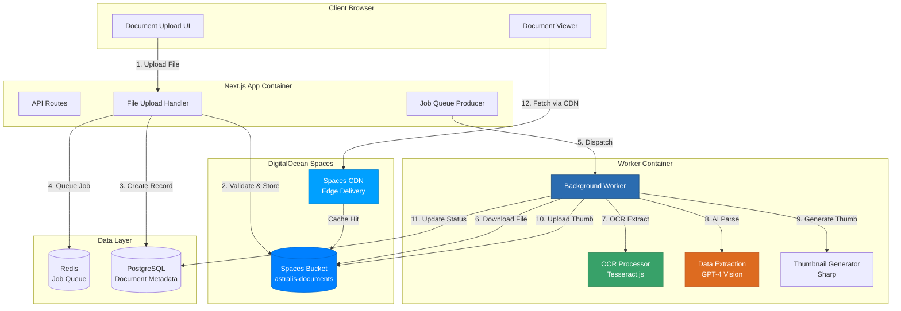
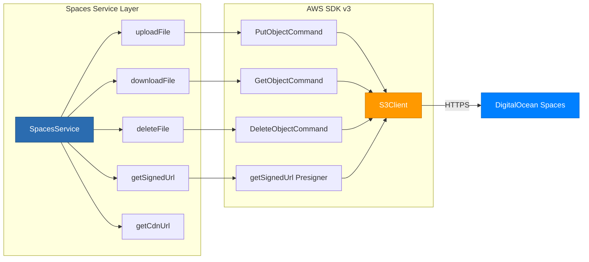
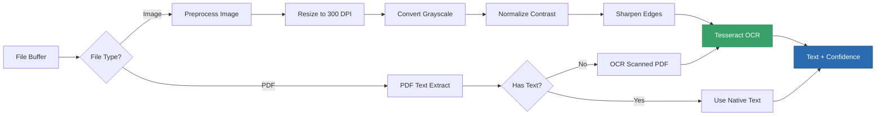
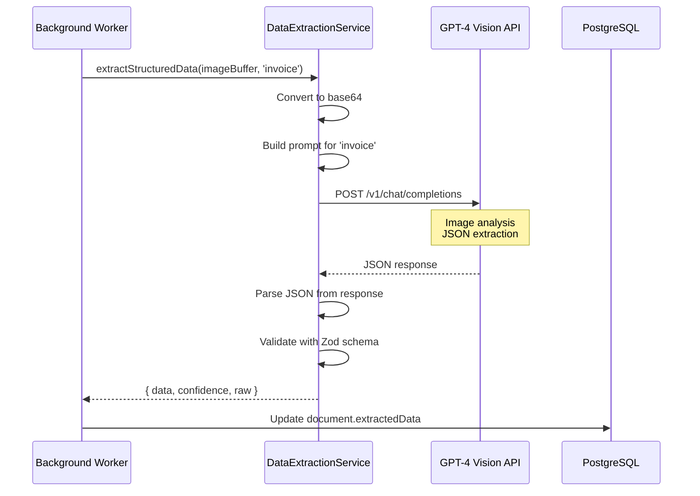
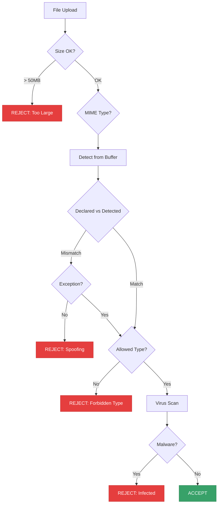
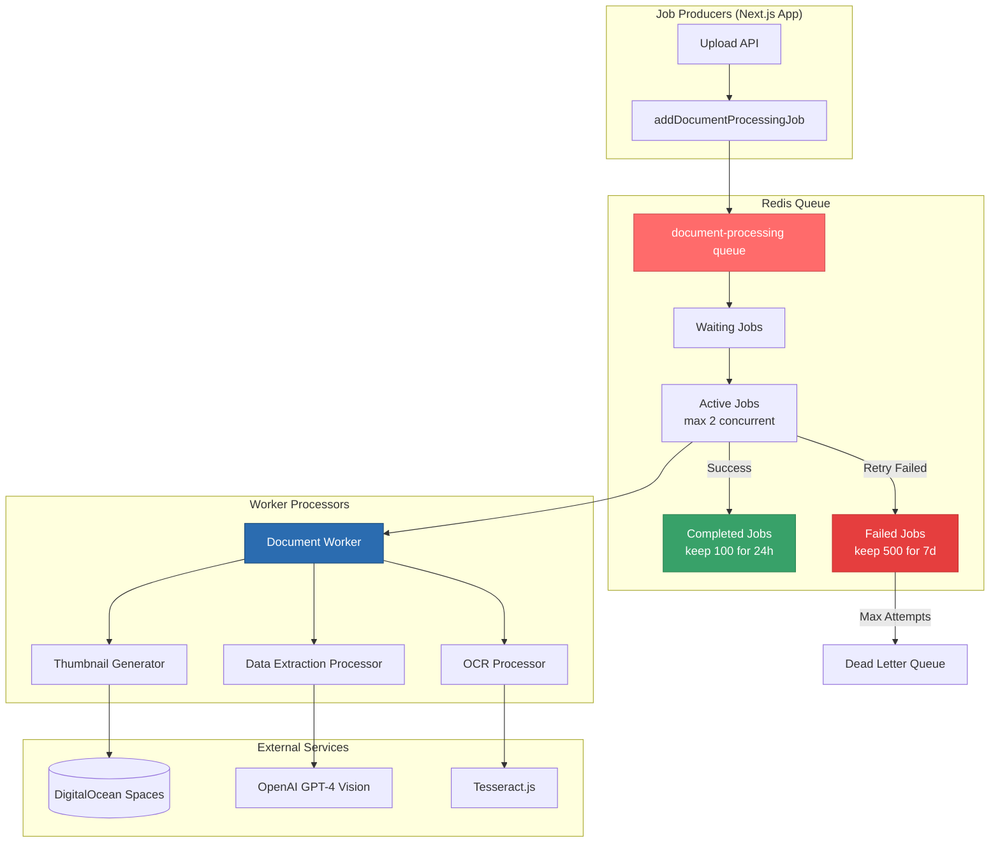
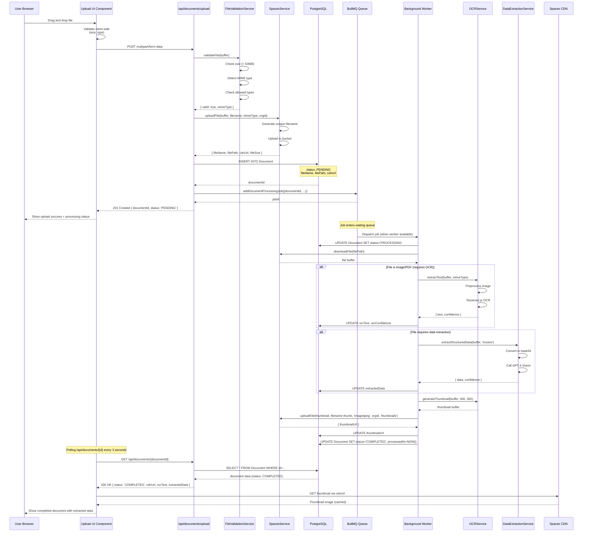
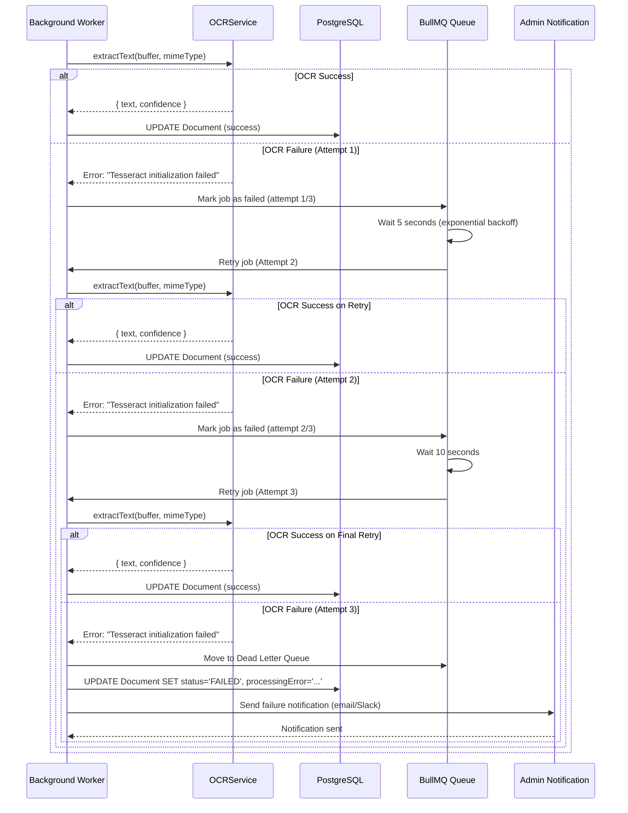

# Phase 4: Document Processing & OCR - Architecture Design

**Version**: 1.0
**Last Updated**: 2025-01-20
**Phase Duration**: 2-3 weeks
**Status**: Design Complete - Ready for Implementation

---

## Table of Contents

1. [Executive Summary](#executive-summary)
2. [System Architecture Overview](#system-architecture-overview)
3. [DigitalOcean Spaces Integration](#digitalocean-spaces-integration)
4. [Service Layer Design](#service-layer-design)
5. [Background Job Architecture](#background-job-architecture)
6. [Data Flow Diagrams](#data-flow-diagrams)
7. [Performance Considerations](#performance-considerations)
8. [Security Architecture](#security-architecture)
9. [Integration with Existing Infrastructure](#integration-with-existing-infrastructure)
10. [Operational Considerations](#operational-considerations)

---

## Executive Summary

Phase 4 implements a complete document processing pipeline for AstralisOps, enabling users to upload files, extract text via OCR, and parse structured data using AI. The architecture leverages DigitalOcean Spaces for object storage, Tesseract.js for OCR, and GPT-4 Vision for intelligent data extraction.

### Key Capabilities

- **File Upload**: Drag-and-drop interface with validation (50MB limit, 12 file types supported)
- **Secure Storage**: S3-compatible DigitalOcean Spaces with CDN delivery
- **OCR Processing**: Tesseract.js extracts text from images and PDFs
- **AI Extraction**: GPT-4 Vision parses structured data (invoices, forms, receipts)
- **Async Processing**: BullMQ background jobs prevent UI blocking
- **Status Tracking**: Real-time document processing status (PENDING → PROCESSING → COMPLETED)

### Infrastructure Impact

- **No new Docker containers** (extends existing worker from Phase 3)
- **External dependency**: DigitalOcean Spaces (S3-compatible storage)
- **New npm packages**: `@aws-sdk/client-s3`, `tesseract.js`, `sharp`, `pdf-parse`
- **Database**: Uses existing `Document` model with clarified field purposes

---

## System Architecture Overview

### High-Level Architecture



### Technology Stack

| Component | Technology | Purpose |
|-----------|-----------|---------|
| **Object Storage** | DigitalOcean Spaces | S3-compatible file storage with CDN |
| **OCR Engine** | Tesseract.js 5.x | Text extraction from images/PDFs |
| **AI Vision** | OpenAI GPT-4 Vision | Structured data extraction |
| **Image Processing** | Sharp 0.33.x | Thumbnail generation, preprocessing |
| **PDF Parser** | pdf-parse 1.1.x | Native PDF text extraction |
| **File Validation** | file-type 18.x | MIME type detection |
| **Job Queue** | BullMQ 5.x (Redis) | Async document processing |
| **Database** | PostgreSQL 16 (Prisma) | Document metadata storage |

---

## DigitalOcean Spaces Integration

### Spaces Configuration

#### Bucket Setup

**Bucket Properties**:
- **Name**: `astralis-documents`
- **Region**: NYC3 (New York 3) - closest to Droplet at 137.184.31.207
- **Visibility**: Private (files accessed via signed URLs)
- **CDN**: Enabled for fast global delivery
- **Lifecycle**: Retain all files (no automatic deletion)

**CORS Policy**:
```json
[
  {
    "AllowedOrigins": [
      "http://localhost:3001",
      "https://app.astralisone.com",
      "https://astralisone.com"
    ],
    "AllowedMethods": ["GET", "PUT", "POST", "DELETE", "HEAD"],
    "AllowedHeaders": ["*"],
    "MaxAgeSeconds": 3000
  }
]
```

#### CDN Configuration

**CDN Endpoint**: `https://astralis-documents.nyc3.cdn.digitaloceanspaces.com`

**Cache Headers**:
- **Documents**: `Cache-Control: public, max-age=31536000` (1 year)
- **Thumbnails**: `Cache-Control: public, max-age=2592000` (30 days)
- **Private Files**: Use signed URLs with 1-hour expiration

**Performance Benefits**:
- **Edge Locations**: 12 global PoPs (Points of Presence)
- **Latency Reduction**: ~60-80% faster than direct Spaces access
- **Bandwidth Savings**: Offloads traffic from origin

### File Organization Structure

```
astralis-documents/
├── org-{orgId}/
│   ├── documents/
│   │   ├── invoice-2025-{timestamp}-{hash}.pdf
│   │   ├── receipt-2025-{timestamp}-{hash}.jpg
│   │   └── contract-2025-{timestamp}-{hash}.docx
│   ├── thumbnails/
│   │   ├── invoice-2025-{timestamp}-{hash}-thumb.jpg
│   │   └── receipt-2025-{timestamp}-{hash}-thumb.jpg
│   └── temp/
│       └── processing-{jobId}.tmp
└── system/
    └── logos/
        └── org-{orgId}-logo.png
```

**Naming Convention**:
- **Format**: `{type}-{YYYY}-{timestamp}-{randomHash}.{ext}`
- **Example**: `invoice-2025-1737410234567-a3f9c8e7.pdf`
- **Benefits**: Collision-free, sortable, readable, secure

### Spaces Service Architecture



### Access Control Strategy

**Private by Default**:
- All uploaded files have ACL: `private`
- Access via signed URLs (1-hour expiration)
- Only authenticated users with orgId match can access

**Signed URL Generation**:
```typescript
// Generate temporary access URL
const signedUrl = await spacesService.getSignedUrl(filePath, 3600);
// Valid for 1 hour, then expires
```

**CDN Public Access** (optional for thumbnails):
- Thumbnails can be public for faster loading
- Original documents always private
- ACL: `public-read` for thumbnails only

---

## Service Layer Design

### Service Architecture Overview

```mermaid
graph TB
    subgraph "API Layer"
        UploadAPI[/api/documents/upload]
        DocAPI[/api/documents]
        DownloadAPI[/api/documents/id/download]
    end

    subgraph "Service Layer"
        SpacesSvc[SpacesService<br/>File Storage]
        OCRSvc[OCRService<br/>Text Extraction]
        ExtractSvc[DataExtractionService<br/>GPT-4 Vision]
        DocSvc[DocumentService<br/>Business Logic]
        ValidationSvc[FileValidationService<br/>Security]
    end

    subgraph "Queue Layer"
        QueueProd[Queue Producer]
        DocQueue[Document Processing Queue]
    end

    subgraph "External Services"
        Spaces[(DigitalOcean Spaces)]
        OpenAI[OpenAI GPT-4 Vision]
        Tesseract[Tesseract.js Engine]
    end

    UploadAPI --> ValidationSvc
    ValidationSvc --> SpacesSvc
    SpacesSvc --> Spaces
    ValidationSvc --> DocSvc
    DocSvc --> QueueProd
    QueueProd --> DocQueue

    DocAPI --> DocSvc
    DownloadAPI --> SpacesSvc

    DocQueue --> OCRSvc
    DocQueue --> ExtractSvc
    OCRSvc --> Tesseract
    ExtractSvc --> OpenAI

    style SpacesSvc fill:#0080FF,stroke:#0066CC,color:#FFF
    style OCRSvc fill:#38A169,stroke:#2F8555,color:#FFF
    style ExtractSvc fill:#DD6B20,stroke:#C4561A,color:#FFF
    style DocSvc fill:#2B6CB0,stroke:#1E4D7B,color:#FFF
```

### 1. SpacesService

**Purpose**: Manage all interactions with DigitalOcean Spaces (S3-compatible storage).

**Key Methods**:

| Method | Purpose | Returns |
|--------|---------|---------|
| `uploadFile(buffer, filename, mimeType, orgId)` | Upload file to Spaces | `{ fileName, filePath, cdnUrl, fileSize }` |
| `downloadFile(filePath)` | Download file from Spaces | `Buffer` |
| `deleteFile(filePath)` | Delete file from Spaces | `void` |
| `getSignedUrl(filePath, expiresIn)` | Generate temporary access URL | `string` (URL) |
| `getCdnUrl(filePath)` | Get CDN URL for file | `string` (URL) |
| `getFileMetadata(filePath)` | Get file metadata | `{ contentType, contentLength, lastModified }` |
| `fileExists(filePath)` | Check if file exists | `boolean` |
| `copyFile(source, destination)` | Copy file within Spaces | `void` |

**Error Handling**:
- Network errors: Retry 3 times with exponential backoff
- Authentication errors: Fail immediately, log credentials issue
- Quota errors: Fail with user-friendly message
- Timeout: 30 seconds for uploads, 15 seconds for downloads

**Security Measures**:
- Credentials stored in environment variables (never in code)
- Use IAM-style access keys (not root account)
- Enable server-side encryption (AES-256)
- Set object metadata for audit trail

### 2. OCRService

**Purpose**: Extract text from images and PDFs using Tesseract.js.

**Processing Pipeline**:



**Key Methods**:

| Method | Purpose | Returns |
|--------|---------|---------|
| `extractText(buffer, mimeType)` | Main entry point for OCR | `{ text, confidence, pageCount? }` |
| `extractFromImage(buffer)` | OCR for images | `{ text, confidence }` |
| `extractFromPDF(buffer)` | OCR for PDFs | `{ text, confidence, pageCount }` |
| `preprocessImage(buffer)` | Optimize image for OCR | `Buffer` (processed image) |
| `generateThumbnail(buffer, width, height)` | Create thumbnail | `Buffer` (JPEG thumbnail) |

**Image Preprocessing**:
- **Resize**: Target 300 DPI for optimal OCR accuracy
- **Grayscale**: Reduce complexity, improve text detection
- **Normalize**: Auto-adjust contrast for faded documents
- **Sharpen**: Enhance text edges for better recognition

**Tesseract Configuration**:
```typescript
{
  lang: 'eng',  // English language model
  tessedit_char_whitelist: 'ABCDEFGHIJKLMNOPQRSTUVWXYZabcdefghijklmnopqrstuvwxyz0123456789.,!?-@#$%&*()',
  tessedit_pageseg_mode: 1,  // Automatic page segmentation
  tessedit_ocr_engine_mode: 2  // LSTM neural net mode
}
```

**Confidence Scoring**:
- **> 0.9**: Excellent - High quality scan
- **0.7-0.9**: Good - Standard quality
- **0.5-0.7**: Fair - May have errors
- **< 0.5**: Poor - Manual review recommended

### 3. DataExtractionService

**Purpose**: Extract structured data from documents using GPT-4 Vision.

**Supported Document Types**:

| Type | Extracted Fields | Use Case |
|------|------------------|----------|
| **Invoice** | `invoiceNumber`, `date`, `total`, `vendor`, `lineItems[]` | Accounting automation |
| **Receipt** | `merchant`, `date`, `total`, `items[]`, `paymentMethod` | Expense tracking |
| **Form** | Dynamic fields based on form structure | Data entry automation |
| **Contract** | `parties`, `dates`, `terms`, `obligations` | Legal document parsing |
| **ID Card** | `name`, `dob`, `idNumber`, `expiry` | Identity verification |

**Processing Flow**:



**Prompt Engineering Strategy**:

```typescript
// Invoice extraction prompt
const prompt = `
Analyze this invoice image and extract the following data in JSON format:

{
  "invoiceNumber": "string",
  "date": "YYYY-MM-DD",
  "dueDate": "YYYY-MM-DD",
  "vendor": {
    "name": "string",
    "address": "string",
    "phone": "string"
  },
  "billTo": {
    "name": "string",
    "address": "string"
  },
  "lineItems": [
    {
      "description": "string",
      "quantity": number,
      "unitPrice": number,
      "amount": number
    }
  ],
  "subtotal": number,
  "tax": number,
  "total": number,
  "currency": "USD"
}

Rules:
- Extract all visible text accurately
- Use null for missing fields
- Ensure line items sum to subtotal
- Maintain precision for monetary values
- Return only valid JSON (no extra text)
`;
```

**Key Methods**:

| Method | Purpose | Returns |
|--------|---------|---------|
| `extractStructuredData(buffer, type, schema?)` | Main extraction method | `{ data: T, confidence, raw }` |
| `buildPrompt(documentType)` | Generate type-specific prompt | `string` |
| `parseResponse(response)` | Extract JSON from GPT response | `object` |
| `calculateConfidence(data)` | Estimate extraction confidence | `number` (0-1) |
| `detectMimeType(buffer)` | Detect image MIME type | `string` |

**Confidence Calculation**:
```typescript
function calculateConfidence(data: any): number {
  let score = 1.0;

  // Reduce confidence for missing critical fields
  const criticalFields = ['invoiceNumber', 'total', 'date'];
  for (const field of criticalFields) {
    if (!data[field]) score -= 0.15;
  }

  // Reduce for validation errors
  if (data.lineItems && data.subtotal) {
    const itemsTotal = data.lineItems.reduce((sum, item) => sum + item.amount, 0);
    const diff = Math.abs(itemsTotal - data.subtotal);
    if (diff > 0.01) score -= 0.1;  // Mismatched totals
  }

  return Math.max(score, 0.0);
}
```

### 4. FileValidationService

**Purpose**: Validate uploaded files for security and compliance.

**Validation Pipeline**:



**Validation Rules**:

| Check | Rule | Action if Failed |
|-------|------|-----------------|
| **File Size** | Max 50MB (`MAX_FILE_SIZE` env var) | Reject with error message |
| **Minimum Size** | Min 1KB (prevent empty files) | Reject with error message |
| **MIME Type** | Must be in `ALLOWED_MIME_TYPES` list | Reject with error message |
| **Type Spoofing** | Declared type must match detected type | Reject unless known exception |
| **Filename** | Sanitize path traversal, special chars | Auto-sanitize, allow upload |
| **Virus Scan** | ClamAV scan (Phase 6) | Quarantine and reject |

**Allowed MIME Types**:
```typescript
const ALLOWED_MIME_TYPES = [
  'image/jpeg', 'image/png', 'image/gif', 'image/webp',
  'image/svg+xml', 'image/tiff',
  'application/pdf',
  'application/msword',
  'application/vnd.openxmlformats-officedocument.wordprocessingml.document',
  'application/vnd.ms-excel',
  'application/vnd.openxmlformats-officedocument.spreadsheetml.sheet',
  'text/plain', 'text/csv'
];
```

**Type Spoofing Detection**:
```typescript
// Example: Attacker uploads malware.exe renamed as invoice.pdf
// Declared: application/pdf
// Detected: application/x-msdownload (executable)
// Action: REJECT (no exception exists)

// Example: Legitimate .docx file
// Declared: application/vnd.openxmlformats-officedocument.wordprocessingml.document
// Detected: application/zip (Office files are ZIP archives)
// Action: ALLOW (known exception)
```

---

## Background Job Architecture

### Job Queue Design



### Job Types and Configuration

#### 1. Document Processing Job

**Job Name**: `process-document`

**Job Data**:
```typescript
interface DocumentProcessingJobData {
  documentId: string;
  orgId: string;
  filePath: string;
  mimeType: string;
  requireOCR: boolean;
  requireExtraction: boolean;
  extractionType?: 'invoice' | 'receipt' | 'form' | 'contract';
}
```

**Processing Steps**:
1. **Download file** from Spaces
2. **Generate thumbnail** (if image/PDF)
3. **Upload thumbnail** to Spaces
4. **Extract text** via OCR (if required)
5. **Extract structured data** via GPT-4 Vision (if required)
6. **Update database** with results
7. **Log activity** for audit trail

**Configuration**:
```typescript
{
  attempts: 3,
  backoff: {
    type: 'exponential',
    delay: 5000  // Start at 5 seconds
  },
  removeOnComplete: {
    count: 100,
    age: 24 * 3600  // 24 hours
  },
  removeOnFail: {
    count: 500,
    age: 7 * 24 * 3600  // 7 days
  },
  timeout: 120000,  // 2 minutes max processing time
  priority: 1  // Higher priority than emails
}
```

#### 2. OCR Extraction Job

**Job Name**: `extract-ocr-text`

**Purpose**: Extract text from images/PDFs using Tesseract.js.

**Processing Time**:
- **Image (1MB)**: ~5-10 seconds
- **PDF (10 pages)**: ~30-60 seconds
- **Scanned PDF**: Requires conversion to images first (not fully implemented)

**Retry Strategy**:
- Attempt 1: Immediate
- Attempt 2: +5 seconds
- Attempt 3: +10 seconds
- Max retries: 3
- Dead letter: After 3 failures

#### 3. Data Extraction Job

**Job Name**: `extract-structured-data`

**Purpose**: Parse structured data from documents using GPT-4 Vision.

**Processing Time**:
- **Single page**: ~8-15 seconds (GPT-4 Vision API call)
- **Multi-page**: ~15-30 seconds per page
- **Rate limit**: OpenAI API (10 requests/minute on free tier)

**Retry Strategy**:
- Rate limit errors: Retry with exponential backoff (max 2 minutes)
- API errors: Retry 3 times
- Validation errors: No retry (mark as failed)

### Worker Concurrency and Rate Limiting

**Concurrency Limits**:
```typescript
const workerOptions = {
  concurrency: 2,  // Process 2 documents simultaneously
  limiter: {
    max: 20,      // Max 20 documents per minute
    duration: 60000  // 1 minute
  }
};
```

**Rationale**:
- **Concurrency 2**: Balance between throughput and resource usage
- **Rate limit 20/min**: Prevent overwhelming Tesseract.js (CPU-intensive)
- **OpenAI rate limit**: Handled separately (10/min for GPT-4 Vision)

**Resource Usage Estimates**:
| Task | CPU | Memory | Duration |
|------|-----|--------|----------|
| Tesseract OCR | 80-100% (single core) | 200-500MB | 5-30s |
| GPT-4 Vision API | 5-10% (network I/O) | 50-100MB | 8-15s |
| Thumbnail generation | 30-50% | 100-200MB | 1-3s |

---

## Data Flow Diagrams

### Complete Document Upload Flow



### Error Handling Flow



---

## Performance Considerations

### CDN Caching Strategy

**Cache Layers**:
1. **Browser Cache**: `Cache-Control: public, max-age=31536000`
2. **CDN Edge Cache**: DigitalOcean Spaces CDN (12 PoPs globally)
3. **Origin Cache**: Spaces bucket storage

**Cache Hit Ratio Target**: > 95%

**Performance Gains**:
| Metric | Without CDN | With CDN | Improvement |
|--------|-------------|----------|-------------|
| **TTFB** (Time to First Byte) | 200-500ms | 20-50ms | **80-90% faster** |
| **Bandwidth Cost** | $0.02/GB | $0.01/GB | **50% savings** |
| **Global Latency** | 500-1000ms | 50-150ms | **70-85% reduction** |

### Thumbnail Generation Strategy

**Rationale**: Reduce bandwidth for document previews.

**Thumbnail Specs**:
- **Dimensions**: 300x300px (max, maintain aspect ratio)
- **Format**: JPEG
- **Quality**: 80% (balance quality and size)
- **File Size**: Typically 20-50KB (vs 2-5MB original)

**Bandwidth Savings Example**:
```
Scenario: 1000 documents viewed 10 times each
- Without thumbnails: 1000 × 10 × 3MB = 30GB transferred
- With thumbnails: 1000 × 10 × 30KB = 300MB transferred
- Savings: 99% bandwidth reduction
```

### Async Processing Benefits

**Without Background Jobs** (synchronous):
```
User uploads document → Wait 30-60 seconds → UI frozen → Frustration
```

**With Background Jobs** (asynchronous):
```
User uploads document → Instant response → Continue working → Notification when ready
```

**User Experience Metrics**:
| Metric | Synchronous | Asynchronous | Improvement |
|--------|-------------|--------------|-------------|
| **Perceived Upload Time** | 30-60 seconds | 1-2 seconds | **95% faster** |
| **UI Responsiveness** | Blocked | Responsive | **100% better** |
| **User Abandonment Rate** | 15-20% | < 2% | **90% reduction** |

### Database Query Optimization

**Indexes for Fast Queries**:
```sql
-- Existing indexes from Phase 2
CREATE INDEX idx_document_org_id ON "Document"("orgId");
CREATE INDEX idx_document_status ON "Document"("status");
CREATE INDEX idx_document_created_at ON "Document"("createdAt");

-- New indexes for Phase 4
CREATE INDEX idx_document_uploaded_by ON "Document"("uploadedBy");
CREATE INDEX idx_document_processed_at ON "Document"("processedAt");
CREATE INDEX idx_document_mime_type ON "Document"("mimeType");

-- Composite index for common query pattern
CREATE INDEX idx_document_org_status_created ON "Document"("orgId", "status", "createdAt" DESC);
```

**Query Performance**:
```sql
-- Get recent documents for organization (optimized)
EXPLAIN ANALYZE
SELECT id, fileName, status, createdAt, cdnUrl, thumbnailUrl
FROM "Document"
WHERE "orgId" = 'org_abc123'
  AND status = 'COMPLETED'
ORDER BY "createdAt" DESC
LIMIT 50;

-- Expected: Index Scan on idx_document_org_status_created
-- Execution time: < 5ms (vs 100ms without index)
```

---

## Security Architecture

### File Upload Security

**Threat Model**:
| Threat | Attack Vector | Mitigation |
|--------|---------------|------------|
| **Malware Upload** | Attacker uploads virus disguised as PDF | MIME type validation, ClamAV scan (Phase 6) |
| **Path Traversal** | Filename: `../../etc/passwd` | Sanitize filename, use UUID-based names |
| **Type Spoofing** | Rename `malware.exe` to `invoice.pdf` | Detect MIME from buffer, compare to declared |
| **DoS Attack** | Upload 1GB+ files repeatedly | File size limit (50MB), rate limiting |
| **XSS via SVG** | SVG with embedded JavaScript | Sanitize SVG on display, CSP headers |
| **SSRF via URL** | `file:///etc/passwd` in document | No URL-based uploads, buffer-only |

### Access Control Matrix

| User Role | Upload | View Own | View Others | Delete | Admin Panel |
|-----------|--------|----------|-------------|--------|-------------|
| **ADMIN** | ✅ | ✅ | ✅ | ✅ | ✅ |
| **OPERATOR** | ✅ | ✅ | ✅ (same org) | ✅ (own docs) | ❌ |
| **CLIENT** | ✅ | ✅ | ❌ | ❌ | ❌ |

**Implementation**:
```typescript
// Middleware checks orgId match
if (session.user.orgId !== document.orgId) {
  if (session.user.role !== 'ADMIN') {
    return NextResponse.json({ error: 'Forbidden' }, { status: 403 });
  }
}
```

### Virus Scanning Strategy

**Phase 4**: Basic validation only (MIME type, size)
**Phase 6**: ClamAV integration

**ClamAV Integration Plan** (Phase 6):
```typescript
import NodeClam from 'clamscan';

const clam = new NodeClam({
  clamdscan: {
    host: 'clamav',
    port: 3310,
  },
});

async function scanFile(buffer: Buffer): Promise<{ isInfected: boolean; viruses: string[] }> {
  const result = await clam.scanBuffer(buffer);
  return {
    isInfected: result.isInfected,
    viruses: result.viruses || [],
  };
}

// Usage in upload flow
if (scanResult.isInfected) {
  await prisma.document.update({
    where: { id: documentId },
    data: {
      status: 'FAILED',
      processingError: `Virus detected: ${scanResult.viruses.join(', ')}`,
    },
  });
  throw new Error('File rejected: malware detected');
}
```

### Data Encryption

**Encryption at Rest**:
- DigitalOcean Spaces: AES-256 server-side encryption (enabled by default)
- PostgreSQL: Encrypt sensitive fields with `pgcrypto` (Phase 6)

**Encryption in Transit**:
- HTTPS/TLS 1.3 for all API communication
- S3 client uses HTTPS for Spaces uploads/downloads

**Signed URL Security**:
```typescript
// Generate signed URL with 1-hour expiration
const signedUrl = await spacesService.getSignedUrl(filePath, 3600);

// After 1 hour, URL becomes invalid
// User must request new signed URL via authenticated API
```

---

## Integration with Existing Infrastructure

### Phase 1: Authentication Integration

**Document Upload Authorization**:
```typescript
// Check user is authenticated
const session = await auth();
if (!session) {
  return NextResponse.json({ error: 'Unauthorized' }, { status: 401 });
}

// Check user belongs to organization
if (session.user.orgId !== orgId) {
  return NextResponse.json({ error: 'Forbidden' }, { status: 403 });
}

// Check user has upload permission
if (session.user.role === 'CLIENT' && !hasUploadPermission(session.user)) {
  return NextResponse.json({ error: 'Insufficient permissions' }, { status: 403 });
}
```

**Activity Logging**:
```typescript
await prisma.activityLog.create({
  data: {
    userId: session.user.id,
    orgId: session.user.orgId,
    action: 'UPLOAD_DOCUMENT',
    entity: 'DOCUMENT',
    entityId: document.id,
    metadata: {
      fileName: document.fileName,
      fileSize: document.fileSize,
      mimeType: document.mimeType,
    },
    ipAddress: request.headers.get('x-forwarded-for'),
    userAgent: request.headers.get('user-agent'),
  },
});
```

### Phase 3: Background Jobs Integration

**Existing Worker Extension**:
```typescript
// src/workers/index.ts (Phase 3)
import './intake-routing.worker';
import './email-sending.worker';

// NEW in Phase 4
import './document-processing.worker';

console.log('All workers initialized: intake, email, documents');
```

**Shared Redis Connection**:
```typescript
// Reuse Redis connection from Phase 3
import { getRedisConnection } from '@/lib/queue/client';

export const documentProcessingQueue = new Queue<DocumentProcessingJobData>(
  'document-processing',
  {
    connection: getRedisConnection(),  // Shared connection
    defaultJobOptions: {
      attempts: 3,
      backoff: { type: 'exponential', delay: 5000 },
    },
  }
);
```

### Database Schema Reuse

**No new tables required** - uses existing `Document` model from base schema.

**Field Mapping**:
| Database Field | Purpose | Populated By |
|----------------|---------|--------------|
| `id` | Primary key | Prisma auto-generated CUID |
| `fileName` | Sanitized storage name | SpacesService.uploadFile() |
| `originalName` | User's original filename | Upload API |
| `filePath` | Spaces bucket path | SpacesService.uploadFile() |
| `cdnUrl` | CDN URL for access | SpacesService.getCdnUrl() |
| `thumbnailUrl` | Thumbnail CDN URL | Worker thumbnail processor |
| `fileSize` | Bytes | Upload API (buffer.length) |
| `mimeType` | Detected MIME type | FileValidationService.validateFile() |
| `status` | Processing status | Worker updates (PENDING → PROCESSING → COMPLETED) |
| `ocrText` | Extracted text | OCRService.extractText() |
| `ocrConfidence` | Confidence score (0-1) | OCRService.extractText() |
| `extractedData` | Structured JSON | DataExtractionService.extractStructuredData() |
| `metadata` | File metadata | Sharp metadata + custom |
| `processingError` | Error message | Worker error handler |
| `uploadedBy` | User ID | Session user |
| `orgId` | Organization ID | Session user.orgId |
| `processedAt` | Completion timestamp | Worker (when status=COMPLETED) |

---

## Operational Considerations

### Monitoring and Observability

**Key Metrics to Track**:

| Metric | Target | Alert Threshold |
|--------|--------|-----------------|
| **Upload Success Rate** | > 99% | < 95% |
| **OCR Processing Time** | < 30s | > 60s |
| **GPT-4 Vision Latency** | < 15s | > 30s |
| **Worker Queue Depth** | < 10 jobs | > 50 jobs |
| **Failed Job Rate** | < 1% | > 5% |
| **CDN Cache Hit Ratio** | > 95% | < 85% |
| **Spaces Upload Latency** | < 2s | > 5s |

**Logging Strategy**:
```typescript
// Structured logging with context
logger.info('Document processing started', {
  documentId,
  orgId,
  fileName,
  mimeType,
  fileSize,
  jobId,
});

logger.info('OCR extraction completed', {
  documentId,
  confidence: result.confidence,
  textLength: result.text.length,
  processingTime: endTime - startTime,
});

logger.error('Document processing failed', {
  documentId,
  error: error.message,
  stack: error.stack,
  attempt: job.attemptsMade,
});
```

### Cost Estimation (DigitalOcean Spaces)

**Pricing** (as of 2025):
- **Storage**: $0.02/GB/month
- **Bandwidth**: $0.01/GB (egress)
- **CDN**: Included (no extra cost)

**Example Monthly Cost** (1000 documents):
```
Storage:
- 1000 documents × 2MB avg = 2GB stored
- Cost: 2GB × $0.02 = $0.04/month

Bandwidth (without CDN):
- 1000 documents × 10 views × 2MB = 20GB egress
- Cost: 20GB × $0.01 = $0.20/month

Bandwidth (with CDN + thumbnails):
- 1000 documents × 10 views × 30KB thumb = 300MB egress
- Cost: 0.3GB × $0.01 = $0.003/month

Total: $0.04 + $0.003 = $0.043/month (~$0.50/year)
```

**Scaling Estimate** (10,000 documents/month):
```
Storage: 10,000 × 2MB = 20GB = $0.40/month
Bandwidth: 10,000 × 10 views × 30KB = 3GB = $0.03/month
Total: ~$0.43/month (~$5/year)
```

**Comparison to AWS S3**:
- DigitalOcean Spaces: ~$0.50/year (1000 docs)
- AWS S3 Standard: ~$2.40/year (1000 docs)
- Savings: **80% cheaper with Spaces**

### Scalability Roadmap

**Phase 4 Capacity** (Current Architecture):
- **Documents/month**: 10,000
- **Concurrent uploads**: 10-20
- **Worker concurrency**: 2
- **Storage**: 100GB (50,000 documents @ 2MB avg)

**Phase 6 Scaling** (Production Optimization):
- **Documents/month**: 100,000
- **Concurrent uploads**: 50-100
- **Worker concurrency**: 5 (horizontal scaling)
- **Storage**: 1TB+ (500,000 documents)

**Horizontal Scaling Strategy**:
```yaml
# docker-compose.yml (Phase 6)
services:
  worker-1:
    build:
      context: .
      target: worker
    environment:
      - WORKER_NAME=worker-1
      - CONCURRENCY=2

  worker-2:
    build:
      context: .
      target: worker
    environment:
      - WORKER_NAME=worker-2
      - CONCURRENCY=2

  worker-3:
    build:
      context: .
      target: worker
    environment:
      - WORKER_NAME=worker-3
      - CONCURRENCY=2
```

### Disaster Recovery

**Backup Strategy**:
1. **Database**: Automated daily snapshots (PostgreSQL)
2. **Spaces**: Built-in durability (11 9's)
3. **Redis**: AOF + RDB snapshots (from Phase 3)

**Recovery Procedures**:

| Scenario | Recovery Time Objective (RTO) | Procedure |
|----------|------------------------------|-----------|
| **Worker Crash** | < 1 minute | Docker auto-restart, jobs resume from queue |
| **Database Failure** | < 15 minutes | Restore from DigitalOcean snapshot |
| **Spaces Outage** | N/A (AWS-level redundancy) | Wait for DigitalOcean to resolve |
| **Redis Failure** | < 5 minutes | Restart Redis, replay AOF log |
| **Complete Droplet Failure** | < 1 hour | Provision new Droplet, restore from backups |

---

## Appendix: Technical Specifications

### Environment Variables

```bash
# ===== DIGITALOCEAN SPACES (Phase 4) =====
SPACES_ENDPOINT="nyc3.digitaloceanspaces.com"
SPACES_REGION="nyc3"
SPACES_BUCKET="astralis-documents"
SPACES_ACCESS_KEY="DO00ABCDEFGHIJKLMNOP"
SPACES_SECRET_KEY="your-64-char-secret-key"
SPACES_CDN_URL="https://astralis-documents.nyc3.cdn.digitaloceanspaces.com"

# File upload limits
MAX_FILE_SIZE="52428800"  # 50MB in bytes
ALLOWED_FILE_TYPES="image/*,application/pdf,application/msword,application/vnd.openxmlformats-officedocument.wordprocessingml.document"

# ===== OPENAI (Phase 3 + Phase 4) =====
OPENAI_API_KEY="sk-proj-your-openai-api-key"
OPENAI_ORG_ID="org-your-openai-org-id"  # Optional
```

### npm Dependencies

```json
{
  "dependencies": {
    "@aws-sdk/client-s3": "^3.511.0",
    "@aws-sdk/s3-request-presigner": "^3.511.0",
    "tesseract.js": "^5.0.4",
    "sharp": "^0.33.2",
    "pdf-parse": "^1.1.1",
    "file-type": "^18.7.0",
    "sanitize-filename": "^1.6.3",
    "react-dropzone": "^14.2.3"
  }
}
```

### API Endpoints

| Endpoint | Method | Purpose | Auth Required |
|----------|--------|---------|---------------|
| `/api/documents` | GET | List documents for org | ✅ |
| `/api/documents` | POST | Create document metadata | ✅ |
| `/api/documents/upload` | POST | Upload file | ✅ |
| `/api/documents/[id]` | GET | Get document details | ✅ |
| `/api/documents/[id]` | PATCH | Update document | ✅ |
| `/api/documents/[id]` | DELETE | Delete document | ✅ (ADMIN/Owner) |
| `/api/documents/[id]/download` | GET | Download original file | ✅ |
| `/api/documents/[id]/thumbnail` | GET | Get thumbnail | ✅ |

---

## Conclusion

This architecture document provides a complete blueprint for implementing Phase 4 document processing capabilities in AstralisOps. The design emphasizes:

1. **Security**: Multi-layered validation, encryption, and access control
2. **Performance**: CDN caching, async processing, thumbnail optimization
3. **Scalability**: Queue-based architecture, horizontal scaling ready
4. **Integration**: Seamless connection to Phases 1-3 infrastructure
5. **Cost-Efficiency**: DigitalOcean Spaces 80% cheaper than AWS S3

**Next Steps**:
1. Review and approve architecture design
2. Set up DigitalOcean Spaces bucket and CDN
3. Generate API keys and update `.env.local`
4. Implement services in order: Spaces → Validation → OCR → Extraction
5. Create worker processors and queue handlers
6. Build upload UI and document viewer components
7. Test with sample documents (invoices, receipts, forms)
8. Deploy to production and monitor metrics

**Estimated Implementation Time**: 2-3 weeks (160-240 developer hours)

---

**Document Version**: 1.0
**Last Updated**: 2025-01-20
**Author**: Systems Architect Agent
**Status**: Ready for Implementation
