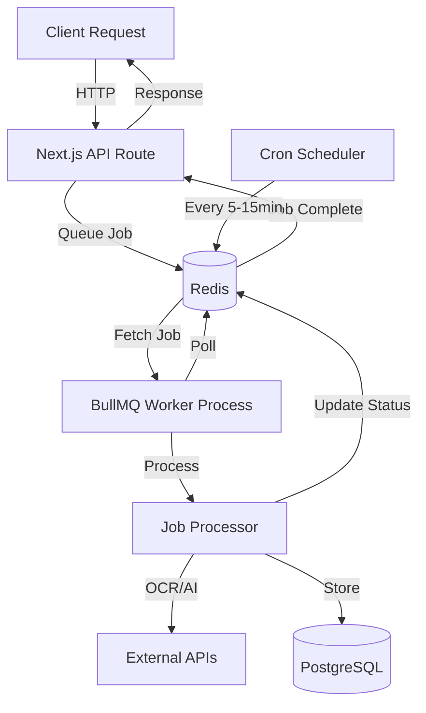
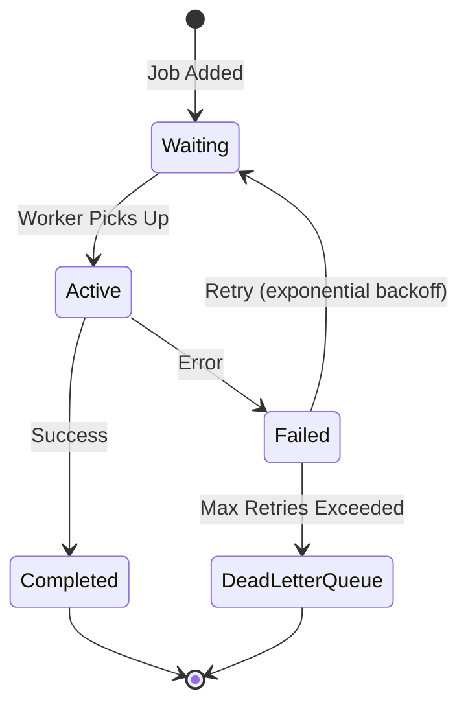

# Background Workers Documentation

Comprehensive guide to Astralis One's background worker system built on BullMQ and Redis.

---

## Table of Contents

1. [Overview](#overview)
2. [Architecture](#architecture)
3. [Worker Configuration](#worker-configuration)
4. [Queue Reference](#queue-reference)
5. [Scheduled Jobs](#scheduled-jobs)
6. [Job Lifecycle](#job-lifecycle)
7. [Error Handling](#error-handling)
8. [Monitoring](#monitoring)
9. [Development](#development)
10. [Production](#production)

---

## 1. Overview

### What are Background Workers?

Background workers process long-running tasks asynchronously outside the main HTTP request/response cycle. This architecture provides:

- **Responsiveness**: API endpoints return immediately, jobs process in background
- **Reliability**: Jobs are persisted to Redis and retry automatically on failure
- **Scalability**: Workers can scale independently from web servers
- **Observability**: Full job history, status tracking, and error logging

### BullMQ + Redis Architecture

Astralis uses **BullMQ** (advanced Bull queue system) backed by **Redis** for job persistence and coordination:

- **Queue**: Named collection of jobs (e.g., `document-processing`, `intake-routing`)
- **Job**: Unit of work with data, status, progress, and retry logic
- **Worker**: Process that consumes jobs from queues
- **Processor**: Function that executes job logic

### Use Cases

Workers handle CPU-intensive, I/O-bound, or time-delayed operations:

- **Document Processing**: OCR extraction, vision analysis (Tesseract.js + GPT-4 Vision)
- **Embeddings**: Generate vector embeddings for RAG (OpenAI text-embedding-3-small)
- **Routing**: AI-powered intake request classification (Orchestration Agent)
- **Scheduling**: Meeting coordination, conflict detection, reminders
- **Calendar Sync**: Google Calendar synchronization
- **SLA Monitoring**: Task compliance checking and breach notifications

---

## 2. Architecture

### System Diagram



### Worker Bootstrap Flow

**File**: `/src/workers/index.ts`

```typescript
startWorkers()
  ├── Load environment variables (.env.local)
  ├── Verify Redis connection
  ├── Verify API keys (OpenAI required)
  ├── Initialize 7 workers:
  │   ├── document-processing (concurrency: 3)
  │   ├── document-embedding (concurrency: 2)
  │   ├── intake-routing (concurrency: 5)
  │   ├── calendar-sync (concurrency: 2)
  │   ├── scheduling-reminders (concurrency: 5)
  │   ├── sla-monitor (concurrency: 2)
  │   └── scheduling-agent (concurrency: 3)
  ├── Setup event handlers (completed, failed, error)
  ├── Initialize scheduled jobs:
  │   ├── SLA Monitor (every 15 minutes)
  │   └── Reminder Scheduler (every 5 minutes)
  └── Setup graceful shutdown handlers (SIGTERM, SIGINT)
```

### Component Interaction

```
┌────────────────────────────────────────────────────────────┐
│ Next.js API Routes (Port 3001)                             │
│ - POST /api/documents/upload → queueDocumentProcessing()   │
│ - POST /api/intake → queueIntakeRouting()                  │
│ - POST /api/scheduling-agent → queueProcessInbox()         │
└────────────────────────────────────────────────────────────┘
                           ↓
┌────────────────────────────────────────────────────────────┐
│ Redis (localhost:6379 or REDIS_URL)                        │
│ - Stores job queues, state, progress, results              │
│ - Handles job scheduling, retries, delays                  │
└────────────────────────────────────────────────────────────┘
                           ↓
┌────────────────────────────────────────────────────────────┐
│ Worker Process (npm run worker)                            │
│ - Polls Redis for jobs                                     │
│ - Executes processors                                      │
│ - Updates job status and progress                          │
└────────────────────────────────────────────────────────────┘
                           ↓
┌────────────────────────────────────────────────────────────┐
│ External Services                                          │
│ - PostgreSQL (Prisma ORM)                                  │
│ - OpenAI API (embeddings, chat, vision)                    │
│ - DigitalOcean Spaces (document storage)                   │
│ - Google Calendar API (calendar sync)                      │
│ - SMTP (email notifications)                               │
│ - Twilio (SMS notifications)                               │
└────────────────────────────────────────────────────────────┘
```

---

## 3. Worker Configuration

### Starting Workers

**Development**:
```bash
npm run worker
# Uses ts-node to run src/workers/index.ts
```

**Production**:
```bash
npm run worker:prod
# Uses compiled JS from dist/workers/index.js
```

**PM2 (Production)**:
```bash
npm run prod:start       # Start both app + worker
npm run prod:stop        # Stop all processes
npm run prod:restart     # Restart all processes
npm run prod:reload      # Zero-downtime reload
npm run prod:logs        # View logs
npm run prod:status      # Process status
```

### Environment Variables

Workers require these environment variables:

```bash
# Required
DATABASE_URL="postgresql://..."
REDIS_URL="redis://localhost:6379"
OPENAI_API_KEY="sk-..."

# Document Processing
SPACES_ENDPOINT="https://nyc3.digitaloceanspaces.com"
SPACES_BUCKET="astralis-documents"
SPACES_ACCESS_KEY="..."
SPACES_SECRET_KEY="..."

# Calendar Sync
GOOGLE_CLIENT_ID="..."
GOOGLE_CLIENT_SECRET="..."
GOOGLE_REDIRECT_URI="http://localhost:3001/api/calendar/google/callback"

# Email Notifications
SMTP_HOST="smtp.gmail.com"
SMTP_PORT="587"
SMTP_USER="..."
SMTP_PASSWORD="..."
SMTP_FROM_EMAIL="support@astralisone.com"
SMTP_FROM_NAME="Astralis"

# SMS Notifications (optional)
TWILIO_ACCOUNT_SID="..."
TWILIO_AUTH_TOKEN="..."
TWILIO_PHONE_NUMBER="+1..."

# AI (optional)
ANTHROPIC_API_KEY="sk-ant-..."  # For Claude models
```

### Redis Configuration

**File**: `/src/workers/redis.ts`

```typescript
// Connection settings
{
  url: process.env.REDIS_URL || 'redis://localhost:6379',
  maxRetriesPerRequest: null,      // Required for BullMQ
  enableReadyCheck: false,          // Required for BullMQ
  retryStrategy: (times) => {
    return Math.min(times * 50, 2000);  // Exponential backoff, max 2s
  }
}
```

**Connection Events**:
- `connect`: TCP connection established
- `ready`: Ready to accept commands
- `error`: Connection error
- `close`: Connection closed
- `reconnecting`: Attempting reconnection

### Concurrency Settings

Each worker has tuned concurrency based on workload characteristics:

| Worker | Concurrency | Rationale |
|--------|-------------|-----------|
| `document-processing` | 3 | CPU-intensive OCR (Tesseract.js) |
| `document-embedding` | 2 | OpenAI API rate limits + cost control |
| `intake-routing` | 5 | Lightweight routing logic |
| `calendar-sync` | 2 | External Google API rate limits |
| `scheduling-reminders` | 5 | Email sending, high throughput |
| `sla-monitor` | 2 | Thorough checks, database queries |
| `scheduling-agent` | 3 | AI classification + scheduling |

**Adjusting Concurrency**:
```typescript
// In src/workers/index.ts
const documentWorker = new Worker('document-processing', processDocumentOCR, {
  connection: redisConnection,
  concurrency: 5,  // Increase if processing falls behind
});
```

---

## 4. Queue Reference

### 4.1 document-processing

**Purpose**: Extract text and structured data from uploaded documents using OCR and AI vision.

**Concurrency**: 3 (CPU-intensive)

**Queue File**: `/src/workers/queues/document-processing.queue.ts`

**Processor**: `/src/workers/processors/ocr.processor.ts`

#### Job Data Structure

```typescript
interface DocumentProcessingJobData {
  documentId: string;           // Primary key in Document table
  orgId: string;                // Organization ID
  documentType?: string;        // 'invoice', 'receipt', 'form', 'generic'
  performOCR?: boolean;         // Default: true
  performVisionExtraction?: boolean;  // GPT-4 Vision (default: false)
  language?: string;            // OCR language (default: 'eng')
}
```

#### Processing Flow

```
1. Update document status → PROCESSING
2. Download file from DigitalOcean Spaces
3. Extract text via Tesseract.js OCR
   - Supports: images (PNG, JPG, TIFF), PDFs
   - Confidence score tracking
4. (Optional) Extract structured data via GPT-4 Vision
   - Document type detection
   - Field extraction (invoices, receipts, forms)
5. Sanitize OCR text (remove null bytes, control chars)
6. Update document with results
7. Queue embedding job (if OCR text exists)
```

#### Retry Strategy

```typescript
{
  attempts: 3,
  backoff: {
    type: 'exponential',
    delay: 5000  // 5s, 10s, 20s
  }
}
```

#### Usage

```typescript
import { queueDocumentProcessing } from '@/workers/queues/document-processing.queue';

await queueDocumentProcessing({
  documentId: 'doc-123',
  orgId: 'org-456',
  documentType: 'invoice',
  performOCR: true,
  performVisionExtraction: true,
  language: 'eng'
});
```

#### Monitoring

```typescript
import { getQueueStats } from '@/workers/queues/document-processing.queue';

const stats = await getQueueStats();
// { waiting: 5, active: 2, completed: 150, failed: 3, total: 160 }
```

---

### 4.2 document-embedding

**Purpose**: Generate vector embeddings for document chunks to enable RAG (Retrieval-Augmented Generation).

**Concurrency**: 2 (API rate limits)

**Queue File**: `/src/workers/queues/document-embedding.queue.ts`

**Processor**: `/src/workers/processors/embedding.processor.ts`

#### Job Data Structure

```typescript
interface DocumentEmbeddingJobData {
  documentId: string;
  orgId: string;
  force?: boolean;  // Re-embed even if embeddings exist (default: false)
}
```

#### Processing Flow

```
1. Fetch document from database
2. Validate OCR text exists
3. Check for existing embeddings (skip if force=false)
4. Initialize OpenAI embedding service
5. Chunk text (overlap strategy for context)
   - Chunk size: ~500 tokens
   - Overlap: 50 tokens
6. Generate embeddings (OpenAI text-embedding-3-small)
   - Batch API requests (max 100 chunks/request)
7. Store embeddings in DocumentEmbedding table
8. Update document metadata
```

#### Chunking Strategy

```typescript
// From EmbeddingService
{
  chunkSize: 500,      // tokens
  overlap: 50,         // tokens
  minChunkSize: 100,   // tokens
  maxChunkSize: 1000   // tokens
}
```

#### Retry Strategy

```typescript
{
  attempts: 3,
  backoff: {
    type: 'exponential',
    delay: 5000
  }
}
```

#### Usage

```typescript
import { queueDocumentEmbedding } from '@/workers/queues/document-embedding.queue';

await queueDocumentEmbedding({
  documentId: 'doc-123',
  orgId: 'org-456',
  force: false
});
```

#### Cost Optimization

- **Model**: `text-embedding-3-small` (62% cheaper than ada-002)
- **Pricing**: $0.00002 per 1K tokens (~$0.02 per 1M tokens)
- **Average document**: ~5,000 tokens = $0.0001
- **Batch processing**: Up to 100 chunks per API call

---

### 4.3 intake-routing

**Purpose**: AI-powered classification and routing of intake requests to appropriate pipelines.

**Concurrency**: 5 (lightweight)

**Queue File**: `/src/workers/queues/intakeRouting.queue.ts`

**Processor**: `/src/workers/processors/intakeRouting.processor.ts`

#### Job Data Structure

```typescript
interface IntakeRoutingJobData {
  intakeRequestId: string;
  orgId: string;
  priority?: string;      // 'low', 'normal', 'high', 'urgent'
  source?: string;        // 'web', 'email', 'api', 'chat'
}
```

#### Processing Flow

```
1. Update intake status → ROUTING
2. Fetch intake request with organization
3. Get active pipelines for routing
4. Orchestration Agent handles routing via events
   - No keyword matching (deprecated)
   - OA analyzes content and assigns pipeline
5. Assign to default "General Intake" pipeline if no match
6. Create PipelineItem in first stage
7. Update intake status → ASSIGNED
```

#### Routing Methods

| Method | Description | When Used |
|--------|-------------|-----------|
| `default` | Assigned to "General Intake" pipeline | No specific match |
| `ai` | AI-powered classification (deprecated, now OA handles) | - |
| `rule-based` | Keyword/pattern matching (deprecated) | - |

**Note**: As of latest commit (65b8d02), keyword routing is removed. Orchestration Agent (OA) is the sole pipeline decision-maker via event handling.

#### Retry Strategy

```typescript
{
  attempts: 3,
  backoff: {
    type: 'exponential',
    delay: 5000
  }
}
```

#### Usage

```typescript
import { queueIntakeRouting } from '@/workers/queues/intakeRouting.queue';

await queueIntakeRouting({
  intakeRequestId: 'intake-123',
  orgId: 'org-456',
  priority: 'high',
  source: 'web'
});
```

---

### 4.4 calendar-sync

**Purpose**: Synchronize events from external calendar providers (Google Calendar) to local SchedulingEvent database.

**Concurrency**: 2 (external API limits)

**Queue File**: `/src/workers/queues/calendarSync.queue.ts`

**Processor**: `/src/workers/processors/calendarSync.processor.ts`

#### Job Data Structure

```typescript
interface CalendarSyncJobData {
  connectionId: string;      // CalendarConnection ID
  userId: string;
  syncType: 'full' | 'incremental';
}
```

#### Processing Flow

```
1. Fetch CalendarConnection from database
2. Verify connection is active
3. Check provider (currently only Google supported)
4. Call Google Calendar API:
   - Fetch events from last sync timestamp
   - Handle pagination (100 events/page)
5. Sync events to SchedulingEvent table:
   - Create new events
   - Update modified events
   - Skip duplicates (googleEventId unique)
6. Update connection lastSyncAt timestamp
7. Reset sync error count on success
```

#### Error Handling

- **Consecutive Errors**: Connection deactivated after 5 failed syncs
- **Token Expiry**: OAuth refresh token automatically used
- **API Rate Limits**: Exponential backoff with jitter

#### Retry Strategy

```typescript
{
  attempts: 3,
  backoff: {
    type: 'exponential',
    delay: 2000
  }
}
```

#### Usage

```typescript
import { queueCalendarSync } from '@/workers/queues/calendarSync.queue';

await queueCalendarSync({
  connectionId: 'conn-123',
  userId: 'user-456',
  syncType: 'incremental'
});
```

#### OAuth Token Management

```typescript
// Tokens stored in CalendarConnection table
{
  accessToken: string;      // Encrypted
  refreshToken: string;     // Encrypted
  expiresAt: Date;         // Token expiry
}

// Auto-refresh handled by googleCalendar.service.ts
if (connection.expiresAt < new Date()) {
  await refreshAccessToken(connection);
}
```

---

### 4.5 scheduling-reminders

**Purpose**: Send email/SMS reminders for scheduled events with calendar attachments.

**Concurrency**: 5 (high throughput)

**Queue File**: `/src/workers/queues/schedulingReminders.queue.ts`

**Processor**: `/src/workers/processors/schedulingReminder.processor.ts`

#### Job Data Structure

```typescript
interface ReminderJobData {
  reminderId: string;     // EventReminder ID
  eventId: string;        // SchedulingEvent ID
}

interface ScanRemindersJobData {
  // Cron job - no data needed
}
```

#### Reminder Types

| Type | When Sent | Status |
|------|-----------|--------|
| `24_HOUR` | 24 hours before event | Implemented |
| `2_HOUR` | 2 hours before event | Implemented |
| `FOLLOW_UP` | After event completion | Implemented |
| `CUSTOM` | User-defined time | Planned |

#### Processing Flow

```
1. Fetch EventReminder and SchedulingEvent
2. Verify reminder status is PENDING
3. Calculate time until event (hours/minutes/days)
4. Format event date/time in user's timezone
5. Generate ICS calendar file attachment
6. Build HTML + plain text email:
   - Event details (title, date, time, location, link)
   - Participant list
   - Meeting description
7. Send email via SMTP (Nodemailer)
8. Update reminder status → SENT
```

#### Email Template

**HTML**: Responsive design with Astralis branding
- Header gradient (navy to slate)
- Event details card
- ICS calendar attachment
- Meeting link (if virtual)
- Participant list

**Text**: Plain text fallback for accessibility

#### ICS Calendar Generation

```typescript
// src/lib/calendar.ts - generateBookingCalendarEvent()
{
  title: event.title,
  startDate: event.startTime,
  duration: minutes,
  location: event.location || event.meetingLink,
  attendees: event.participantEmails,
  organizer: 'support@astralisone.com'
}
```

#### Retry Strategy

```typescript
{
  attempts: 3,
  backoff: {
    type: 'exponential',
    delay: 5000
  }
}
```

#### Usage

```typescript
import { queueReminder } from '@/workers/queues/schedulingReminders.queue';

await queueReminder({
  reminderId: 'reminder-123',
  eventId: 'event-456'
});
```

---

### 4.6 sla-monitor

**Purpose**: Monitor task SLA compliance, detect warnings/breaches, trigger escalations.

**Concurrency**: 2 (thorough checks)

**Queue File**: `/src/workers/queues/sla-monitor.queue.ts`

**Processor**: `/src/workers/processors/slaMonitor.processor.ts`

#### Job Data Structure

```typescript
interface SLAMonitorJobData {
  orgId?: string;    // Check specific org (omit for all orgs)
  taskId?: string;   // Check specific task
}
```

#### SLA Status Levels

| Status | Threshold | Action |
|--------|-----------|--------|
| `COMPLIANT` | < 75% of SLA elapsed | No action |
| `WARNING` | 75-100% of SLA elapsed | Warning notification |
| `BREACHED` | > 100% of SLA elapsed | Breach notification + escalation |

#### Processing Flow

```
1. Determine scope (single task, org, all orgs)
2. Query tasks with SLA targets:
   - Status: IN_PROGRESS, NOT_STARTED
   - Has dueDate or slaTarget
3. For each task:
   - Calculate time elapsed vs SLA
   - Determine status (COMPLIANT, WARNING, BREACHED)
   - Emit AgentEvent if status changed
4. Aggregate summary:
   - Total checked
   - Warning count
   - Breach count
   - Error count
```

#### SLA Calculation

```typescript
const now = new Date();
const dueDate = task.dueDate || task.slaTarget;
const elapsed = now - task.createdAt;
const total = dueDate - task.createdAt;
const percentage = (elapsed / total) * 100;

if (percentage >= 100) return 'BREACHED';
if (percentage >= 75) return 'WARNING';
return 'COMPLIANT';
```

#### Event Emission

```typescript
// SLA Warning Event
{
  type: 'SLA_WARNING',
  taskId: 'task-123',
  percentage: 82.5,
  remainingTime: '3 hours'
}

// SLA Breach Event
{
  type: 'SLA_BREACH',
  taskId: 'task-123',
  breachTime: '2024-01-15T10:30:00Z',
  escalationRequired: true
}
```

#### Retry Strategy

```typescript
{
  attempts: 2,  // Lower retries for cron jobs
  backoff: {
    type: 'exponential',
    delay: 10000  // 10s
  }
}
```

#### Usage

```typescript
import { queueSLAMonitor } from '@/workers/queues/sla-monitor.queue';

// Check all orgs
await queueSLAMonitor({});

// Check specific org
await queueSLAMonitor({ orgId: 'org-123' });

// Check specific task
await queueSLAMonitor({ taskId: 'task-456' });
```

---

### 4.7 scheduling-agent

**Purpose**: AI-powered task classification, meeting scheduling, conflict detection, and response generation.

**Concurrency**: 3 (AI + scheduling)

**Queue File**: `/src/workers/queues/schedulingAgent.queue.ts`

**Processor**: `/src/workers/processors/schedulingAgent.processor.ts`

#### Job Types

```typescript
type SchedulingAgentJobType =
  | 'process-inbox'       // AI classification
  | 'schedule-meeting'    // Execute scheduling
  | 'send-response'       // Send email/SMS/chat/webhook
  | 'retry-task';         // Retry failed task
```

#### Job Data Structures

**process-inbox**:
```typescript
{
  taskId: string;
  userId: string;
  orgId?: string;
  priority?: number;  // 1-5 (1=highest)
}
```

**schedule-meeting**:
```typescript
{
  taskId: string;
  userId: string;
  schedulingData: {
    title: string;
    startTime: string;     // ISO 8601
    endTime: string;       // ISO 8601
    participants?: string[];
    location?: string;
    description?: string;
  };
  checkConflicts?: boolean;  // Default: true
}
```

**send-response**:
```typescript
{
  taskId: string;
  userId: string;
  responseType: 'confirmation' | 'alternatives' | 'clarification' | 'error';
  channel: 'email' | 'sms' | 'chat' | 'webhook';
  recipientEmail?: string;
  recipientPhone?: string;
  webhookUrl?: string;
  metadata?: Record<string, unknown>;
}
```

**retry-task**:
```typescript
{
  taskId: string;
  userId: string;
  reason: string;
  previousAttempts: number;
}
```

#### AI Classification (process-inbox)

**Model**: GPT-4 Turbo

**Task Types**:
- `SCHEDULE_MEETING`: Create new meeting
- `RESCHEDULE_MEETING`: Modify existing meeting
- `CANCEL_MEETING`: Cancel meeting
- `CHECK_AVAILABILITY`: Query free/busy
- `CREATE_TASK`: Non-meeting task
- `UPDATE_TASK`: Modify task
- `INQUIRY`: General question
- `REMINDER`: Set reminder
- `UNKNOWN`: Unclear intent

**Extracted Entities**:
```typescript
{
  date?: string;           // '2024-01-15'
  time?: string;           // '14:00'
  duration?: number;       // minutes
  participants?: string[]; // email addresses
  subject?: string;        // meeting title
  location?: string;       // physical or virtual
  eventId?: string;        // for reschedule/cancel
}
```

**Priority Assignment**: 1-5 based on urgency keywords, deadline proximity

**Confidence Score**: 0-1, requires manual review if < 0.7

#### Conflict Detection (schedule-meeting)

**Process**:
1. Query existing SchedulingEvents for time overlap
2. Check participant availability (if Google Calendar connected)
3. If conflicts found:
   - Find 5 alternative slots
   - Queue "alternatives" response
   - Update task status → AWAITING_INPUT
4. If no conflicts:
   - Create SchedulingEvent
   - Queue "confirmation" response
   - Update task status → SCHEDULED

**Alternative Slot Algorithm**:
```typescript
// src/lib/services/conflict.service.ts
- Look ahead 7 days from requested date
- Find slots matching requested duration
- Check against existing events
- Rank by proximity to original request
- Return top 5 alternatives
```

#### Response Channels

**Email** (`sendEmailResponse`):
- HTML + text versions
- Meeting details card
- ICS calendar attachment
- Participant list
- Branded Astralis template

**SMS** (`sendSmsResponse`):
- Twilio integration
- Character limit optimization
- Fallback to email link
- Confirmation codes

**Chat** (`sendChatMessage`):
- Pusher real-time delivery
- Database persistence
- Structured message types
- Action buttons (accept/decline)

**Webhook** (`sendWebhook`):
- n8n integration
- HMAC signature (WEBHOOK_SECRET)
- Retry with exponential backoff (max 3 attempts)
- Event types: `scheduling.confirmed`, `scheduling.conflict_detected`, `scheduling.cancelled`

#### Retry Strategy

```typescript
{
  attempts: 3,
  backoff: {
    type: 'exponential',
    delay: 2000  // 2s, 4s, 8s
  }
}

// Retry-task job has progressive delay
{
  delay: Math.min(previousAttempts * 5000, 60000)  // Max 60s
}
```

#### Usage

```typescript
import {
  queueProcessInbox,
  queueScheduleMeeting,
  queueSendResponse,
  queueRetryTask
} from '@/workers/queues/schedulingAgent.queue';

// 1. Classify new task
await queueProcessInbox({
  taskId: 'task-123',
  userId: 'user-456',
  priority: 2
});

// 2. Schedule meeting
await queueScheduleMeeting({
  taskId: 'task-123',
  userId: 'user-456',
  schedulingData: {
    title: 'Project Review',
    startTime: '2024-01-15T14:00:00Z',
    endTime: '2024-01-15T15:00:00Z',
    participants: ['john@example.com'],
    location: 'Conference Room A'
  }
});

// 3. Send confirmation
await queueSendResponse({
  taskId: 'task-123',
  userId: 'user-456',
  responseType: 'confirmation',
  channel: 'email'
});

// 4. Retry on failure
await queueRetryTask({
  taskId: 'task-123',
  userId: 'user-456',
  reason: 'AI classification timed out',
  previousAttempts: 1
});
```

---

## 5. Scheduled Jobs

Recurring jobs that run on a cron schedule to maintain system health and send timely notifications.

### 5.1 SLA Monitor Job

**Purpose**: Periodically check all tasks for SLA compliance and trigger alerts.

**Schedule**: Every 15 minutes (`*/15 * * * *`)

**File**: `/src/workers/jobs/sla-monitor.job.ts`

**Setup**:
```typescript
// Called in src/workers/index.ts on worker startup
await initializeSLAMonitorJob();
```

**Execution Flow**:
```
1. Get all organizations
2. For each organization:
   - Query pending tasks with SLA targets
   - Check each task for warning/breach
   - Emit AgentEvents for status changes
   - Track errors and summary stats
3. Aggregate global summary:
   - Total tasks checked
   - Total warnings
   - Total breaches
   - Organization errors
```

**Manual Trigger**:
```typescript
import { triggerSLACheck } from '@/workers/jobs/sla-monitor.job';

// Check all orgs
await triggerSLACheck();

// Check specific org
await triggerSLACheck('org-123');
```

**Performance**:
- Average execution: ~500ms per 100 tasks
- Memory usage: < 50MB
- No blocking operations (async queries)

---

### 5.2 Reminder Scheduler Job

**Purpose**: Scan for pending event reminders that need to be sent.

**Schedule**: Every 5 minutes (`*/5 * * * *`)

**File**: `/src/workers/jobs/reminder-scheduler.job.ts`

**Setup**:
```typescript
await initializeReminderSchedulerJob();
```

**Execution Flow**:
```
1. Query EventReminders:
   - status = PENDING
   - reminderTime <= now
   - LIMIT 100 (batch processing)
2. For each reminder:
   - Queue reminder job
   - Log success/failure
3. Mark failed reminders:
   - status = FAILED
   - Increment retryCount
   - Store error message
4. Return summary:
   - Scanned count
   - Queued count
   - Error count
```

**Manual Trigger**:
```typescript
import { triggerReminderScan } from '@/workers/jobs/reminder-scheduler.job';

await triggerReminderScan();
// Returns: { scanned: 12, queued: 12, errors: 0 }
```

**Reminder Creation**:
```typescript
// Automatically created when SchedulingEvent is saved
// src/lib/services/scheduling.service.ts
await prisma.eventReminder.createMany({
  data: [
    {
      eventId: event.id,
      userId: event.userId,
      reminderTime: new Date(startTime.getTime() - 24 * 60 * 60 * 1000),  // 24h before
      type: '24_HOUR',
      status: 'PENDING'
    },
    {
      eventId: event.id,
      userId: event.userId,
      reminderTime: new Date(startTime.getTime() - 2 * 60 * 60 * 1000),   // 2h before
      type: '2_HOUR',
      status: 'PENDING'
    }
  ]
});
```

**Performance**:
- Average execution: ~300ms for 100 reminders
- Memory usage: < 30MB
- Email queue depth: Limited by concurrency (5)

---

## 6. Job Lifecycle

### Job States



### State Transitions

| State | Description | Next States |
|-------|-------------|-------------|
| **Waiting** | Job queued, awaiting worker | Active, Delayed |
| **Delayed** | Job scheduled for future execution | Waiting |
| **Active** | Currently being processed by worker | Completed, Failed |
| **Completed** | Successfully processed | - |
| **Failed** | Processing failed, awaiting retry | Waiting, DeadLetterQueue |
| **DeadLetterQueue** | Max retries exceeded, manual intervention needed | - |

### Job Progress Tracking

Workers update job progress throughout processing:

```typescript
export async function processDocumentOCR(job: Job<DocumentProcessingJobData>) {
  await job.updateProgress(10);   // Started
  // ... download file
  await job.updateProgress(30);   // Downloaded
  // ... run OCR
  await job.updateProgress(60);   // OCR complete
  // ... extract data
  await job.updateProgress(90);   // Data extracted
  // ... save to database
  await job.updateProgress(100);  // Finished
}
```

**Progress Monitoring**:
```typescript
const job = await documentProcessingQueue.getJob('doc-123');
console.log(`Progress: ${job.progress}%`);
```

### Job Results

Successful jobs return structured results:

```typescript
// Document Processing
{
  success: true,
  documentId: 'doc-123',
  ocrTextLength: 5420,
  confidence: 0.92,
  hasStructuredData: true,
  embeddingQueued: true
}

// Embedding
{
  success: true,
  documentId: 'doc-123',
  chunksCreated: 12,
  embeddingsGenerated: 12,
  processingTimeMs: 2340,
  avgChunkSize: 450
}

// Intake Routing
{
  success: true,
  intakeRequestId: 'intake-123',
  pipelineId: 'pipeline-456',
  pipelineItemId: 'item-789',
  assignedUserId: null,
  routingMethod: 'default'
}
```

### Job Cleanup

**Automatic Cleanup** (configured per queue):
```typescript
{
  removeOnComplete: {
    age: 24 * 3600,  // Keep 24 hours
    count: 1000       // Keep last 1000
  },
  removeOnFail: {
    age: 7 * 24 * 3600  // Keep 7 days
  }
}
```

**Manual Cleanup**:
```typescript
import { cleanSchedulingAgentQueue } from '@/workers/queues/schedulingAgent.queue';

await cleanSchedulingAgentQueue(
  86400000,  // 24 hours in ms
  1000       // max jobs to clean
);
```

---

## 7. Error Handling

### Retry Strategies

**Exponential Backoff**:
```typescript
{
  attempts: 3,
  backoff: {
    type: 'exponential',
    delay: 5000  // 5s base delay
  }
}

// Retry schedule:
// Attempt 1: immediate
// Attempt 2: 5s delay
// Attempt 3: 10s delay
// Attempt 4: 20s delay (if attempts: 4)
```

**Fixed Delay**:
```typescript
{
  attempts: 5,
  backoff: {
    type: 'fixed',
    delay: 10000  // Always 10s
  }
}
```

**Custom Retry Strategy**:
```typescript
{
  attempts: 10,
  backoff: (attemptsMade, err) => {
    // Progressive delay with jitter
    const baseDelay = Math.pow(2, attemptsMade) * 1000;
    const jitter = Math.random() * 1000;
    return Math.min(baseDelay + jitter, 60000);  // Max 60s
  }
}
```

### Error Logging

**Worker-Level Logging**:
```typescript
documentWorker.on('failed', (job, err) => {
  console.error(`[Worker:OCR] Job ${job?.id} failed:`, err.message);
  // Stored in Redis job.failedReason
});

documentWorker.on('error', (err) => {
  console.error('[Worker:OCR] Worker error:', err);
  // Critical worker-level error
});
```

**Processor-Level Logging**:
```typescript
export async function processDocumentOCR(job: Job) {
  try {
    // ... processing logic
  } catch (error) {
    console.error(`[Worker] Document processing error for ${job.data.documentId}:`, error);

    // Update database with error
    await prisma.document.update({
      where: { id: job.data.documentId },
      data: {
        status: 'FAILED',
        processingError: error instanceof Error ? error.message : 'Unknown error'
      }
    });

    throw error;  // Re-throw for BullMQ retry logic
  }
}
```

### Error Categories

| Category | Retry? | Action |
|----------|--------|--------|
| **Network Error** | Yes | Exponential backoff |
| **API Rate Limit** | Yes | Longer delay (60s+) |
| **Invalid Input** | No | Mark job failed, notify user |
| **Missing Resource** | No | Mark job failed, alert admin |
| **Database Error** | Yes | Retry with backoff |
| **Out of Memory** | Yes | Reduce concurrency |
| **Timeout** | Yes | Increase timeout, retry |

### Dead Letter Queue

Jobs that exceed max retries move to failed state:

```typescript
// Query failed jobs
const failedJobs = await documentProcessingQueue.getFailed(0, 100);

for (const job of failedJobs) {
  console.log({
    id: job.id,
    data: job.data,
    failedReason: job.failedReason,
    attemptsMade: job.attemptsMade,
    finishedOn: job.finishedOn
  });

  // Manual recovery
  if (shouldRetry(job)) {
    await job.retry();  // Reset attempts, re-queue
  } else {
    await job.remove();  // Permanently delete
  }
}
```

### Graceful Degradation

Workers handle missing dependencies gracefully:

```typescript
// Twilio SMS (optional)
if (!process.env.TWILIO_ACCOUNT_SID) {
  console.log('[Worker:SMS] Twilio not configured, skipping SMS');
  return { success: true, skipped: true, reason: 'Twilio not configured' };
}

// Google Calendar (optional)
if (!connection.isActive) {
  console.log('[Worker:CalendarSync] Connection inactive, skipping');
  return { success: true, skipped: true, reason: 'Connection inactive' };
}
```

---

## 8. Monitoring

### PM2 Dashboard

**View Process Status**:
```bash
pm2 status
# ┌─────┬──────────────────┬─────────┬─────────┬─────────┬──────────┐
# │ id  │ name             │ status  │ restart │ uptime  │ cpu      │
# ├─────┼──────────────────┼─────────┼─────────┼─────────┼──────────┤
# │ 0   │ astralis-nextjs  │ online  │ 0       │ 2h      │ 0.5%     │
# │ 1   │ astralis-worker  │ online  │ 0       │ 2h      │ 2.3%     │
# └─────┴──────────────────┴─────────┴─────────┴─────────┴──────────┘

pm2 monit  # Interactive CPU/memory monitor
```

**View Logs**:
```bash
pm2 logs astralis-worker          # Stream logs
pm2 logs astralis-worker --lines 100  # Last 100 lines
pm2 logs astralis-worker --err    # Error logs only

# Log files (configured in ecosystem.config.js)
tail -f /var/log/pm2/astralis-worker-out.log
tail -f /var/log/pm2/astralis-worker-error.log
```

**Restart on Error**:
```javascript
// ecosystem.config.js
{
  name: 'astralis-worker',
  autorestart: true,
  max_restarts: 10,
  min_uptime: '10s',
  max_memory_restart: '512M'
}
```

### Redis Monitoring

**CLI**:
```bash
redis-cli

# Queue stats
KEYS bull:*           # List all BullMQ keys
LLEN bull:document-processing:wait     # Waiting jobs
LLEN bull:document-processing:active   # Active jobs
LLEN bull:document-processing:failed   # Failed jobs

# Job details
HGETALL bull:document-processing:doc-123

# Clear queue (destructive!)
DEL bull:document-processing:wait
DEL bull:document-processing:failed
```

**RedisInsight** (GUI):
- Download: https://redis.com/redis-enterprise/redis-insight/
- Connect to `localhost:6379` or `REDIS_URL`
- Browse keys, view job data, monitor memory

### Queue Metrics API

**Implementation**:
```typescript
// src/app/api/workers/stats/route.ts
import { getQueueStats } from '@/workers/queues/document-processing.queue';
import { getSchedulingAgentQueueStats } from '@/workers/queues/schedulingAgent.queue';

export async function GET() {
  const stats = {
    documentProcessing: await getQueueStats(),
    schedulingAgent: await getSchedulingAgentQueueStats(),
    timestamp: new Date().toISOString()
  };

  return NextResponse.json(stats);
}
```

**Response**:
```json
{
  "documentProcessing": {
    "waiting": 3,
    "active": 2,
    "completed": 156,
    "failed": 4,
    "total": 165
  },
  "schedulingAgent": {
    "waiting": 0,
    "active": 1,
    "completed": 42,
    "failed": 0,
    "delayed": 2,
    "total": 45
  },
  "timestamp": "2024-01-15T14:30:00Z"
}
```

### Health Checks

**Worker Health Endpoint**:
```typescript
// src/app/api/health/worker/route.ts
export async function GET() {
  const redis = redisConnection;
  const isHealthy = redis.status === 'ready';

  return NextResponse.json({
    status: isHealthy ? 'healthy' : 'unhealthy',
    redis: redis.status,
    workers: 7,
    timestamp: new Date().toISOString()
  }, {
    status: isHealthy ? 200 : 503
  });
}
```

**Uptime Monitoring** (external):
- UptimeRobot: https://uptimerobot.com
- Pingdom: https://www.pingdom.com
- Configure alerts for `/api/health/worker` endpoint

### Log Aggregation

**Production Setup**:
```bash
# Install log rotation
sudo apt install logrotate

# Configure rotation (/etc/logrotate.d/pm2)
/var/log/pm2/*.log {
  daily
  rotate 14
  compress
  delaycompress
  notifempty
  create 0640 deploy deploy
  sharedscripts
  postrotate
    pm2 reloadLogs
  endscript
}
```

**Centralized Logging** (optional):
- **Papertrail**: Cloud log aggregation
- **Datadog**: Full observability platform
- **Elasticsearch + Kibana**: Self-hosted

---

## 9. Development

### Running Workers Locally

**Terminal 1** (Next.js app):
```bash
npm run dev
# App runs on http://localhost:3001
```

**Terminal 2** (Redis):
```bash
# Docker
docker run -d -p 6379:6379 redis:7-alpine

# macOS (Homebrew)
brew install redis
redis-server

# Ubuntu
sudo apt install redis-server
sudo systemctl start redis
```

**Terminal 3** (Worker):
```bash
npm run worker
# [Workers] Starting document processing and embedding workers...
# [Workers] Environment check:
#   - OPENAI_API_KEY: SET (sk-proj-...)
#   - DATABASE_URL: SET
#   - REDIS_URL: SET
# [Workers] Document processing worker started (concurrency: 3)
# [Workers] Document embedding worker started (concurrency: 2)
# [Workers] Intake routing worker started (concurrency: 5)
```

**Testing Job Processing**:
```bash
# Upload document to trigger OCR
curl -X POST http://localhost:3001/api/documents/upload \
  -H "Content-Type: application/json" \
  -d '{
    "fileName": "invoice.pdf",
    "orgId": "org-123"
  }'

# Watch worker logs
# [Worker:OCR] Processing document doc-abc123
# [Worker:OCR] Downloaded file from Spaces: 245678 bytes
# [Worker:OCR] Starting OCR extraction for application/pdf...
# [Worker:OCR] OCR completed: 3456 chars, confidence: 89.2%
# [Worker:OCR] Document doc-abc123 processing completed
# [Worker:OCR] Job doc-abc123 completed
```

### Testing Individual Processors

**Unit Test Pattern**:
```typescript
// tests/workers/ocr.processor.test.ts
import { processDocumentOCR } from '@/workers/processors/ocr.processor';
import { Job } from 'bullmq';

describe('OCR Processor', () => {
  it('should extract text from PDF', async () => {
    const mockJob = {
      data: {
        documentId: 'test-doc-123',
        orgId: 'test-org',
        performOCR: true
      },
      updateProgress: jest.fn()
    } as unknown as Job;

    const result = await processDocumentOCR(mockJob);

    expect(result.success).toBe(true);
    expect(result.ocrTextLength).toBeGreaterThan(0);
    expect(mockJob.updateProgress).toHaveBeenCalledWith(100);
  });
});
```

**Integration Test**:
```typescript
// tests/workers/integration.test.ts
import { queueDocumentProcessing } from '@/workers/queues/document-processing.queue';
import { prisma } from '@/lib/prisma';

describe('Document Processing Pipeline', () => {
  it('should process document end-to-end', async () => {
    // Create test document
    const doc = await prisma.document.create({
      data: {
        fileName: 'test.pdf',
        filePath: 'test/test.pdf',
        orgId: 'test-org',
        status: 'UPLOADED'
      }
    });

    // Queue processing
    await queueDocumentProcessing({
      documentId: doc.id,
      orgId: doc.orgId
    });

    // Wait for processing
    await new Promise(resolve => setTimeout(resolve, 5000));

    // Verify results
    const processed = await prisma.document.findUnique({
      where: { id: doc.id }
    });

    expect(processed.status).toBe('COMPLETED');
    expect(processed.ocrText).toBeTruthy();
  }, 10000);
});
```

### Debugging Tips

**Enable Verbose Logging**:
```typescript
// src/workers/index.ts
documentWorker.on('progress', (job, progress) => {
  console.log(`[Debug] Job ${job.id} progress: ${progress}%`);
});

documentWorker.on('active', (job) => {
  console.log(`[Debug] Job ${job.id} started at ${new Date().toISOString()}`);
});
```

**Inspect Job Data**:
```typescript
const job = await documentProcessingQueue.getJob('doc-123');
console.log('Job data:', JSON.stringify(job.data, null, 2));
console.log('Job state:', await job.getState());
console.log('Job progress:', job.progress);
console.log('Job logs:', job.logs);
```

**Pause Queue for Debugging**:
```typescript
await documentProcessingQueue.pause();
// Make changes, test manually
await documentProcessingQueue.resume();
```

**Step-Through Debugging**:
```json
// .vscode/launch.json
{
  "type": "node",
  "request": "launch",
  "name": "Debug Worker",
  "runtimeExecutable": "npm",
  "runtimeArgs": ["run", "worker"],
  "skipFiles": ["<node_internals>/**"],
  "env": {
    "NODE_ENV": "development"
  }
}
```

### Adding New Queues

**Step 1**: Create queue definition
```typescript
// src/workers/queues/my-new-queue.queue.ts
import { Queue } from 'bullmq';
import { redisConnection } from '../redis';

export const myNewQueue = new Queue('my-new-queue', {
  connection: redisConnection,
  defaultJobOptions: {
    attempts: 3,
    backoff: { type: 'exponential', delay: 5000 }
  }
});

export interface MyNewJobData {
  taskId: string;
  userId: string;
}

export async function queueMyNewJob(data: MyNewJobData) {
  await myNewQueue.add('process-task', data, {
    jobId: `task-${data.taskId}`
  });
}
```

**Step 2**: Create processor
```typescript
// src/workers/processors/myNew.processor.ts
import { Job } from 'bullmq';
import type { MyNewJobData } from '../queues/my-new-queue.queue';

export async function processMyNewJob(job: Job<MyNewJobData>) {
  const { taskId, userId } = job.data;

  await job.updateProgress(10);
  // ... processing logic
  await job.updateProgress(100);

  return { success: true, taskId };
}
```

**Step 3**: Register worker
```typescript
// src/workers/index.ts
import { processMyNewJob } from './processors/myNew.processor';

const myNewWorker = new Worker('my-new-queue', processMyNewJob, {
  connection: redisConnection,
  concurrency: 3
});

myNewWorker.on('completed', (job) => {
  console.log(`[Worker:MyNew] Job ${job.id} completed`);
});

myNewWorker.on('failed', (job, err) => {
  console.error(`[Worker:MyNew] Job ${job?.id} failed:`, err.message);
});
```

---

## 10. Production

### Deployment Checklist

- [ ] **Environment Variables**: All required vars set in `.env.local`
- [ ] **Redis**: Production Redis instance running (DigitalOcean Managed, AWS ElastiCache, etc.)
- [ ] **Database**: PostgreSQL accessible from worker server
- [ ] **API Keys**: OpenAI, Anthropic, Google, Twilio configured
- [ ] **Log Directory**: `/var/log/pm2` exists with proper permissions
- [ ] **PM2 Installed**: `npm install -g pm2`
- [ ] **Build Compiled**: `npm run build` successful
- [ ] **Worker Script**: `npm run worker:prod` tested locally

### PM2 Production Configuration

**File**: `/ecosystem.config.js`

```javascript
module.exports = {
  apps: [
    {
      name: 'astralis-nextjs',
      script: 'npm',
      args: 'run start',
      instances: 1,
      exec_mode: 'fork',
      autorestart: true,
      watch: false,
      max_memory_restart: '1G',
      error_file: '/var/log/pm2/astralis-error.log',
      out_file: '/var/log/pm2/astralis-out.log',
      log_date_format: 'YYYY-MM-DD HH:mm:ss Z',
    },
    {
      name: 'astralis-worker',
      script: 'npm',
      args: 'run worker:prod',
      cwd: '/home/deploy/astralis-nextjs',
      instances: 1,
      exec_mode: 'fork',
      autorestart: true,
      watch: false,
      max_memory_restart: '512M',
      error_file: '/var/log/pm2/astralis-worker-error.log',
      out_file: '/var/log/pm2/astralis-worker-out.log',
      log_date_format: 'YYYY-MM-DD HH:mm:ss Z',
    }
  ]
};
```

**Start Production Workers**:
```bash
cd /home/deploy/astralis-nextjs
pm2 start ecosystem.config.js
pm2 save
pm2 startup  # Enable on boot
```

### Scaling Workers

**Horizontal Scaling** (multiple servers):
```bash
# Server 1: App + Worker
pm2 start ecosystem.config.js

# Server 2: Worker only
pm2 start ecosystem.config.js --only astralis-worker

# Server 3: Worker only
pm2 start ecosystem.config.js --only astralis-worker
```

**Vertical Scaling** (increase concurrency):
```typescript
// Adjust in src/workers/index.ts
const documentWorker = new Worker('document-processing', processDocumentOCR, {
  connection: redisConnection,
  concurrency: 10  // Increased from 3
});
```

**Auto-Scaling** (cluster mode):
```javascript
// ecosystem.config.js
{
  name: 'astralis-worker',
  instances: 'max',  // Use all CPU cores
  exec_mode: 'cluster'
}
```

**Warning**: BullMQ workers handle concurrency internally. Cluster mode may cause race conditions. Use single instance with high concurrency instead.

### Memory Management

**Monitor Memory Usage**:
```bash
pm2 monit
# astralis-worker: 245 MB (max: 512 MB)
```

**Tune Memory Limits**:
```javascript
{
  max_memory_restart: '512M',  // Restart if exceeds
  node_args: '--max-old-space-size=512'  // V8 heap limit
}
```

**Memory Leak Detection**:
```bash
# Install memwatch
npm install @airbnb/node-memwatch

# Add to worker
import memwatch from '@airbnb/node-memwatch';

memwatch.on('leak', (info) => {
  console.error('[Worker] Memory leak detected:', info);
});
```

### High Availability

**Redis Failover** (Sentinel):
```typescript
// src/workers/redis.ts
import { Redis } from 'ioredis';

export const redisConnection = new Redis({
  sentinels: [
    { host: 'sentinel-1', port: 26379 },
    { host: 'sentinel-2', port: 26379 },
    { host: 'sentinel-3', port: 26379 }
  ],
  name: 'mymaster',
  maxRetriesPerRequest: null,
  enableReadyCheck: false
});
```

**Redis Cluster**:
```typescript
import { Cluster } from 'ioredis';

export const redisConnection = new Cluster([
  { host: 'redis-1', port: 6379 },
  { host: 'redis-2', port: 6379 },
  { host: 'redis-3', port: 6379 }
], {
  maxRetriesPerRequest: null,
  enableReadyCheck: false
});
```

**Health Checks**:
```bash
# Add to monitoring system (Nagios, Datadog, etc.)
curl http://localhost:3001/api/health/worker
# { "status": "healthy", "redis": "ready", "workers": 7 }
```

### Disaster Recovery

**Backup Redis**:
```bash
# Daily snapshot
redis-cli BGSAVE

# Copy RDB file
cp /var/lib/redis/dump.rdb /backups/redis-$(date +%Y%m%d).rdb
```

**Restore Queue State**:
```bash
# Stop workers
pm2 stop astralis-worker

# Restore Redis dump
cp /backups/redis-20240115.rdb /var/lib/redis/dump.rdb
sudo systemctl restart redis

# Restart workers
pm2 start astralis-worker
```

**Job Replay** (PostgreSQL audit trail):
```typescript
// Query failed jobs from database
const failedDocs = await prisma.document.findMany({
  where: {
    status: 'FAILED',
    updatedAt: { gte: new Date('2024-01-15') }
  }
});

// Re-queue for processing
for (const doc of failedDocs) {
  await queueDocumentProcessing({
    documentId: doc.id,
    orgId: doc.orgId
  });
}
```

### Performance Optimization

**Queue Prioritization**:
```typescript
await queueDocumentProcessing(data, {
  priority: 1  // 1=highest, 10=lowest
});
```

**Batch Processing**:
```typescript
// Queue multiple jobs efficiently
const jobs = documents.map(doc => ({
  name: 'process-document',
  data: { documentId: doc.id, orgId: doc.orgId }
}));

await documentProcessingQueue.addBulk(jobs);
```

**Rate Limiting**:
```typescript
// Limit job throughput
const rateLimiter = {
  max: 100,       // Max 100 jobs
  duration: 60000 // Per 60 seconds
};

const documentWorker = new Worker('document-processing', processDocumentOCR, {
  connection: redisConnection,
  limiter: rateLimiter
});
```

**Connection Pooling** (PostgreSQL):
```typescript
// prisma/schema.prisma
datasource db {
  provider = "postgresql"
  url      = env("DATABASE_URL")
  connectionLimit = 10  // Adjust based on worker count
}
```

---

## Troubleshooting

### Common Issues

**1. Worker not processing jobs**

**Symptoms**: Jobs stuck in "waiting" state, no log activity

**Diagnosis**:
```bash
# Check Redis connection
redis-cli ping
# PONG

# Check worker process
pm2 status astralis-worker
# Status should be "online"

# Check worker logs
pm2 logs astralis-worker --lines 50
```

**Solutions**:
- Verify `REDIS_URL` environment variable
- Restart Redis: `sudo systemctl restart redis`
- Restart worker: `pm2 restart astralis-worker`
- Check firewall rules (port 6379)

---

**2. Jobs failing immediately**

**Symptoms**: Jobs move to "failed" with error

**Diagnosis**:
```bash
# Check error logs
pm2 logs astralis-worker --err

# Inspect failed job in Redis
redis-cli
LRANGE bull:document-processing:failed 0 0
```

**Solutions**:
- Verify API keys (OpenAI, Google, etc.)
- Check database connectivity
- Verify file storage access (Spaces)
- Review processor error handling

---

**3. High memory usage**

**Symptoms**: Worker memory grows over time, eventually crashes

**Diagnosis**:
```bash
pm2 monit
# Watch memory usage over time

# Heap dump
node --heap-prof src/workers/index.ts
```

**Solutions**:
- Reduce concurrency settings
- Increase `max_memory_restart` in PM2 config
- Add pagination to database queries
- Clear large variables after use
- Enable garbage collection logs: `node --expose-gc`

---

**4. Slow job processing**

**Symptoms**: Jobs take longer than expected

**Diagnosis**:
```typescript
// Add timing logs to processor
const startTime = Date.now();
// ... processing
console.log(`Processing took ${Date.now() - startTime}ms`);
```

**Solutions**:
- Increase worker concurrency
- Scale horizontally (more worker servers)
- Optimize database queries (add indexes)
- Cache frequently accessed data (Redis)
- Use CDN for file downloads

---

**5. Cron jobs not running**

**Symptoms**: SLA monitor or reminder scheduler not executing

**Diagnosis**:
```bash
# Check worker startup logs
pm2 logs astralis-worker | grep "cron job initialized"

# Check Redis repeatable jobs
redis-cli KEYS bull:*:repeat
```

**Solutions**:
- Verify `initializeSLAMonitorJob()` called in `src/workers/index.ts`
- Check cron expression syntax
- Clear old repeat jobs: `await queue.removeRepeatable('job-name', { cron: '...' })`

---

## Additional Resources

### Documentation

- **BullMQ**: https://docs.bullmq.io
- **Redis**: https://redis.io/docs
- **PM2**: https://pm2.keymetrics.io/docs
- **Prisma**: https://www.prisma.io/docs
- **OpenAI**: https://platform.openai.com/docs

### Internal Files

- `src/workers/index.ts` - Worker bootstrap
- `src/workers/redis.ts` - Redis connection config
- `src/workers/queues/` - Queue definitions
- `src/workers/processors/` - Job processors
- `src/workers/jobs/` - Scheduled jobs
- `ecosystem.config.js` - PM2 configuration
- `CLAUDE.md` - Project overview

### Support

- **GitHub Issues**: https://github.com/astralisone/astralis-nextjs/issues
- **Team Slack**: #engineering
- **Documentation**: https://docs.astralisone.com

---

**Last Updated**: 2025-01-15
**Version**: 1.0
**Maintained by**: Engineering Team
